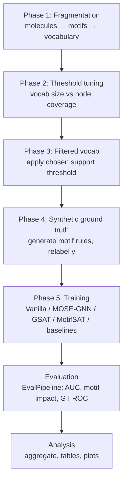

# ChemIntuit — Explainable Molecular GNN

ChemIntuit is a research harness for **motif-based explainable molecular graph neural networks (GNNs)**. The core idea: break molecules into chemically meaningful fragments ("motifs"), build a motif vocabulary, then train GNNs that explain their predictions in terms of which motifs matter — and evaluate explanation quality fairly across several model families.

> The detailed operational guide lives in [`RUNBOOK.md`](RUNBOOK.md). This README gives the conceptual overview, module map, and quick-start commands.

## Table of Contents

- [Overview](#overview)
- [Pipeline](#pipeline)
- [Repository Structure](#repository-structure)
- [Modules](#modules)
- [Model Families](#model-families)
- [Quick Start](#quick-start)
- [Configuration](#configuration)
- [Dependencies](#dependencies)
- [Testing](#testing)

## Overview

ChemIntuit fragments molecules into motifs, builds vocabularies and synthetic ground-truth rules, trains several GNN families (MOSE-GNN, MotifSAT/GSAT, vanilla + post-hoc explainers), and evaluates explanation quality at the motif level. All model families plug into a shared GNN backbone and are scored by a single unified evaluation pipeline, enabling fair comparison across explainability paradigms.

## Pipeline

The project is organized into numbered **phases**, driven by `run_experiments.sh`:



1. **Fragmentation** — Cut each molecule with a chemistry cascade (rBRICS → BRICS → RECAP → Murcko), optionally falling back to structural cuts and a BPE-style merge. Produces a motif vocabulary plus per-atom→motif lookups.
2. **Threshold tuning** — Plot how vocabulary size trades off against atom coverage, then pick a support threshold.
3. **Filtered vocab** — Regenerate the vocabulary applying that threshold.
4. **Synthetic ground truth** — Auto-generate logical rules over motifs (e.g. "motif A AND NOT B → positive") and relabel the data, so explanation quality can be measured against a known answer.
5. **Training** — Train the model families (below) on the same data and vocabulary.
6. **Evaluation** — A unified `EvalPipeline` scores both prediction accuracy and explanation quality (motif impact, score↔impact correlation, ground-truth ROC).
7. **Analysis** — Aggregate runs into tables and plots.

### Data flow

`MotifBreakdown` produces the vocabulary → `SharedModules/data` loads graphs and vocab → each model package (`MOSE-GNN`, `MotifSAT`, `baselines`) trains on the same data → everything is scored by `SharedModules/evaluation/EvalPipeline` → `analysis/` aggregates results. The model packages add the repo root to `sys.path` and import `SharedModules.*`, so `SharedModules` is the hub everything depends on.

## Repository Structure

```
.
├── RUNBOOK.md                 # Main operational guide
├── experiment_config.sh       # Central paths, datasets, folds, backbones
├── run_experiments.sh         # Phased pipeline dispatcher
├── run_experiments.py         # Unified Python experiment grid driver
├── run_priority.sh            # Self-contained 8-variant demo sweep
│
├── MotifBreakdown/            # Fragmentation, vocabulary, rules, GT labeling
├── SharedModules/             # Shared data, models, evaluation, baselines
│   ├── data/                  # Datasets, loaders, vocab, ground truth
│   ├── models/                # BaseGNN backbone + conv layers
│   ├── evaluation/            # EvalPipeline + metrics
│   └── baselines/             # Vanilla GNN + post-hoc explainers
├── MOSE-GNN/                  # Ante-hoc model with global motif importance
├── MotifSAT/                  # Attention-based explainer (GSAT family)
└── analysis/                  # Post-hoc reporting, tables, plots
```

> Generated artifacts (`results/`, `vocab_output/`, `processed/`, `wandb/`, `*.pt`, etc.) are git-ignored.

## Modules

### `MotifBreakdown/` — data preprocessing & motif vocabulary

The fragmentation engine and rule generator.

| File | Purpose |
|------|---------|
| `generate_vocab_rules.py` | **Main CLI**; runs the fragmentation cascade and writes vocabulary pickles, `matrix.npz`, and `rules.json` |
| `molfragbpe5.py` | Fragmentation engine (chemistry cuts + structural fallback + BPE merge) |
| `motif_label_pipeline.py` | Generates the synthetic motif rules used as ground truth |
| `rBRICS_public.py`, `chemfrag*.py`, `merge.py` | Supporting fragmentation algorithms/variants |
| `coverage_vs_threshold.py` | Threshold sweep plots (vocab size vs coverage) |
| `export_*_to_csv.py` | Convert mutag/OGB datasets into the expected CSV fold format |
| `test_pipeline.py` | 133 unit tests for fragmentation |

### `SharedModules/` — shared infrastructure

Common code used by every model.

- **`data/`** — `dataset.py` (CSV → PyG graphs), `loader.py` (train/val/test loader factory), `vocab.py` (loads motif pickles), `apply_gt.py` (Phase 4: writes synthetic-GT relabelled `{split}_with_gt.pt` caches with `node_label`/`edge_label`), `ground_truth.py` (`GT_SUPPORTED_DATASETS`; the in-process GT path is dormant), `dataset_schema.py` (single source of truth for label columns).
- **`models/`** — `gnn_base.py` (the shared `BaseGNN` backbone) and `conv_layers.py` (GIN/GCN/GAT/SAGE/PNA layers with attention scaling).
- **`evaluation/`** — `pipeline.py` (the orchestrator) plus `metrics.py`, `motif_eval.py` (mask-removal impact, correlations), `multi_explanation.py`, `embedding_viz.py`, `wandb_logger.py`.
- **`baselines/`** — `vanilla_gnn.py` (plain GNN), `run_vanilla.py` (trains it + runs post-hoc explainers), and the post-hoc explainers `gnn_explainer.py` / `pg_explainer.py` / `mage.py`.

### `MOSE-GNN/` — ante-hoc model with global motif importance

Learns one global importance weight σ(θ_m) per vocabulary motif, injected into features/messages/readout.

- `config.py` / `reg_config.py` (hyperparameters & regularization), `model.py` (single/multi-channel GNN), `train.py` (loss + entropy/size regularization), `run.py` (CLI entry).

### `MotifSAT/` — attention-based explainer (GSAT family)

Node-level attention with an information-bottleneck loss; optionally pools attention to motif level.

- `config.py`, `model.py` (GSAT), `motif_modules.py` (motif pooling/scoring), `losses.py` (IB + consistency), `train.py`, `run.py`.

### `analysis/` — post-hoc reporting

- `run_analysis.py` (umbrella CLI: regenerate / collect / table / plots), plus `make_results_table.py`, `plot_score_vs_impact.py`, `aggregate_experiments.py`, `probe_masked_nodes.py`.

## Model Families

| Family | Type | How it explains |
|--------|------|-----------------|
| Vanilla GNN | baseline | none (plain backbone) |
| GNNExplainer / PGExplainer / MAGE | post-hoc | node/edge masks or embedding distance, aggregated to motifs |
| MOSE-GNN | ante-hoc | global learned weight per motif |
| Base GSAT | ante-hoc | node attention + information bottleneck |
| MotifSAT | ante-hoc | motif-level readout scoring |

A shared flag system (`w_feat`, `w_message`, `w_readout`) controls *where* motif/attention weights get injected into the common `BaseGNN`, so all methods plug into the same backbone for fair comparison.

## Quick Start

### One-time setup

```bash
source experiment_config.sh   # Edit DATA_ROOT, DATASETS, etc. first
```

### Phased pipeline (recommended)

```bash
bash run_experiments.sh phase1            # Fragmentation (3 variants)
bash run_experiments.sh phase2            # Coverage plots → edit CHOSEN_THRESHOLD
bash run_experiments.sh phase3            # Thresholded vocabs
export RULE_INDEX=0
bash run_experiments.sh phase4            # Synthetic GT cache
bash run_experiments.sh phase5_vanilla
bash run_experiments.sh phase5_mose
bash run_experiments.sh phase5_gsat
bash run_experiments.sh phase5_motifsat
bash run_experiments.sh phase5_baselines
bash run_experiments.sh collect
bash run_experiments.sh analyze
```

### Unified Python grid

```bash
python3 run_experiments.py --experiments mose --datasets BBBP --folds 0 \
  --injection 111,101 --preset onehot_nonorm,linear_norm --out_root ./RESULTS
```

### Individual model CLIs

```bash
# MOSE-GNN
python3 MOSE-GNN/run.py --dataset Mutagenicity --fold 0 --backbone GIN \
  --w_feat --w_readout --data_root $DATA_ROOT --vocab_root $VOCAB_ROOT \
  --vocab_variant rbrics_filter --out_dir $OUT_ROOT/mose

# MotifSAT (readout)
python3 MotifSAT/run.py --dataset Mutagenicity --fold 0 --motif_method readout \
  --w_feat --w_readout --w_message --noise none --info_loss_coef 0.0 \
  --data_root $DATA_ROOT --vocab_root $VOCAB_ROOT --out_dir $OUT_ROOT/motifsat

# Vanilla + post-hoc explainers
python3 SharedModules/baselines/run_vanilla.py --dataset BBBP --fold 0 \
  --backbone GIN --epochs 100 --data_root $DATA_ROOT --vocab_root $VOCAB_ROOT \
  --out_dir $OUT_ROOT/vanilla
```

### Standalone vocabulary generation

```bash
python3 MotifBreakdown/generate_vocab_rules.py \
  --datasets Mutagenicity --data_root $DATA_ROOT --out_dir $VOCAB_ROOT \
  --method all --fallback --bpe --variant all_fallback_bpe --fold 0
```

### Analysis

```bash
python3 analysis/run_analysis.py all \
  --out_root $OUT_ROOT --data_root $DATA_ROOT --vocab_root $VOCAB_ROOT
```

## Configuration

| File | Role |
|------|------|
| `experiment_config.sh` | Central paths and hyperparameters for shell runners |
| `MOSE-GNN/config.py` | `MOSEConfig` — model, training, eval, W&B, GT flags |
| `MotifSAT/config.py` | `MotifSATConfig` — motif method, noise, IB, injection |
| `MOSE-GNN/reg_config.py` | Per (backbone, dataset) regularization and layer counts |
| `MotifBreakdown/generate_vocab_rules.py` | `CHOSEN_THRESHOLD` per variant × dataset |
| `SharedModules/data/dataset_schema.py` | `DATASET_COLUMN`, `TASK_TYPE` |

YAML configs are supported via `--config config.yaml` on the MOSE-GNN and MotifSAT `run.py` entry points.

Input data is expected as fold CSVs at `DATA_ROOT/{dataset}_{fold}.csv` with columns `smiles`, `group` (training/valid/test), and a dataset-specific label column (see `dataset_schema.py`). OGB and mutag datasets require the corresponding `export_*_to_csv.py` script first.

## Dependencies

No `requirements.txt` is provided; dependencies are inferred from imports.

**Core:** `torch`, `torch_geometric`, `numpy`, `pandas`, `scipy`, `scikit-learn`, `rdkit`, `tqdm`, `PyYAML`

**Optional:** `ogb` (OGB datasets), `torch_scatter` (faster scatter; PyG fallback exists), `matplotlib` (plots), `wandb` (logging), `PIL` (embedding viz)

## Testing

```bash
cd MotifBreakdown && python3 test_pipeline.py -v
cd SharedModules && python3 tests/test_shared_modules.py
cd MOSE-GNN && python3 tests/test_mose_gnn.py
cd MotifSAT && python3 tests/test_motifsat.py
```
